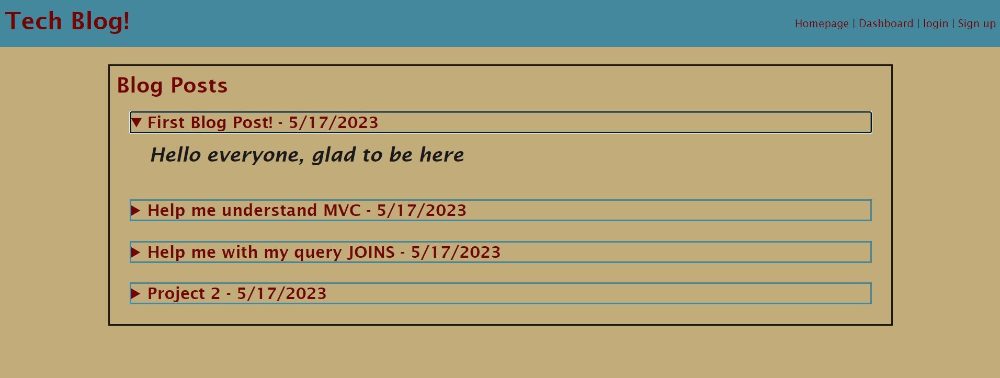
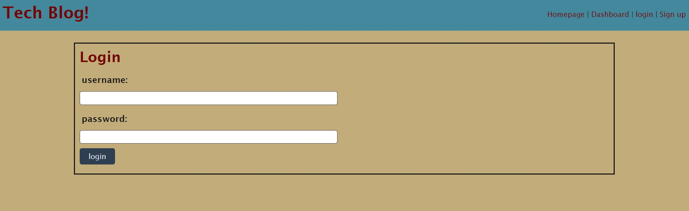
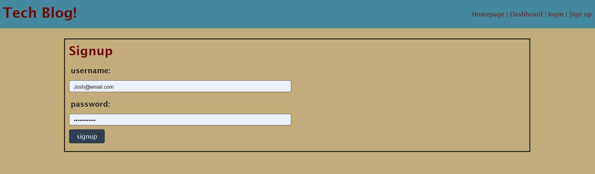
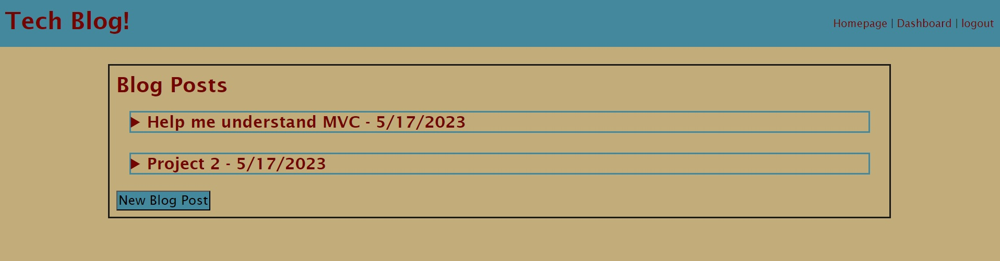
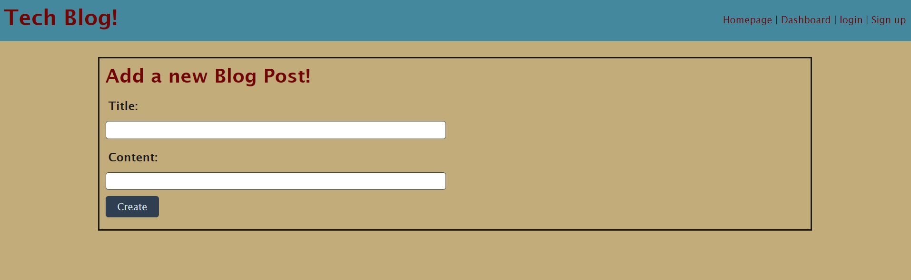
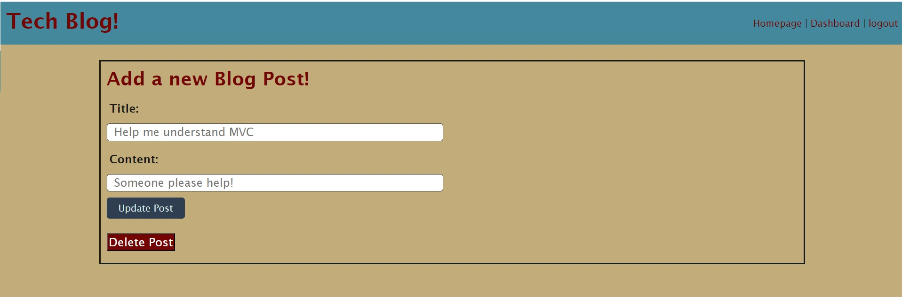
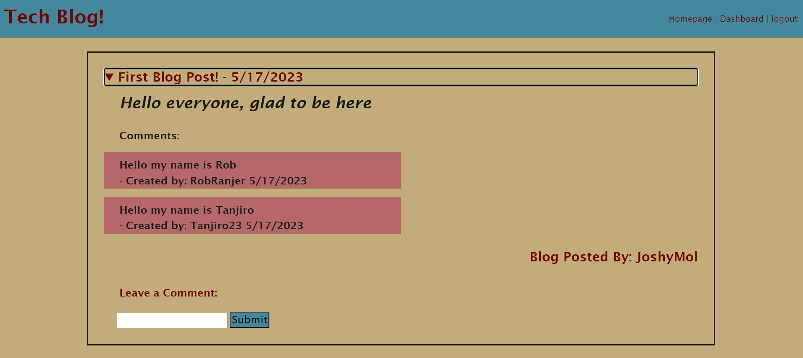

# Tech-Blog

## Description

Created a Tech Blog where users can view blog posts made by other users and participate in the community by signing up for the blog, so that they can create their own blog posts as well as comment on other users blog posts. 

Published website:  https://guarded-bastion-01373.herokuapp.com/

## Installation

N/A

## Usage

Use Kevin Molyneaux's Tech Blog to get involved in a community of like-minded users on the topic of Technology!

## Credits

N/A

## License

MIT License - Please refer to the LICENSE in the repo.

## Usage
The following image shows the home page of the Tech Blog, which allows users to see blog titles and content prior to signing up:

The follwing image shows the login page for the Tech Blog:

The following image shows the sign up page for the Tech Blog: 

The following image shows the user Dashboard you are redirected to after login or sign up, which would have any posts you have created: 

The following image shows the New Blog Post page where you can enter your blog post title and content and create a new post: 

The following image shows the update / delete post page where users can update current blog posts or delete it: 

The following image shows the page of a single blog posts which opens up when you click on the title of a blog posts on the homepage. This pages shows user comments which are hidden on the homepage, as well as giving you the option to add a comment of your own to a users blog post: 

